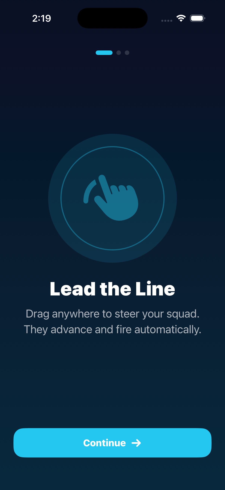
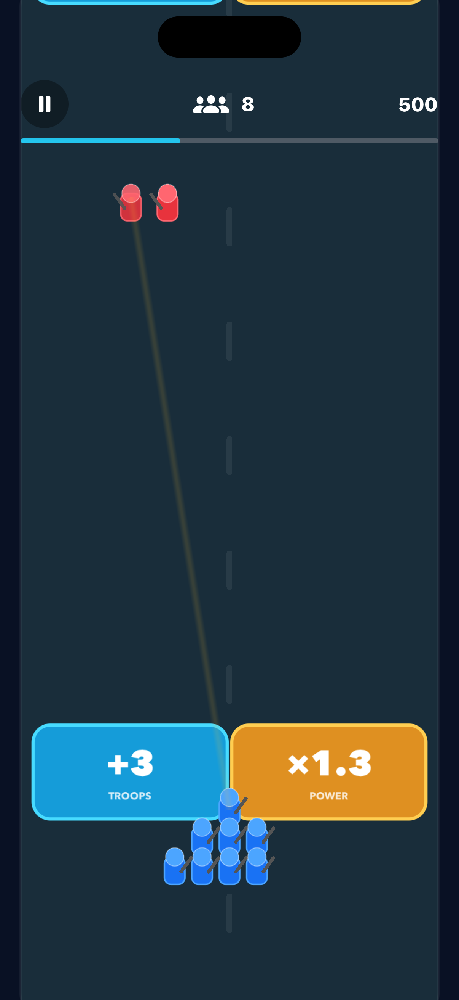
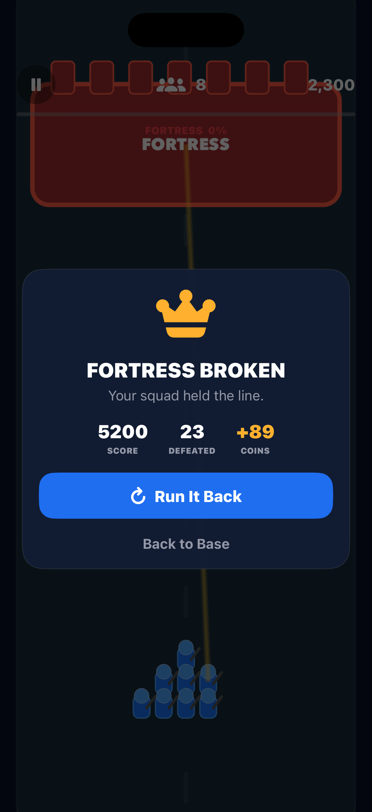
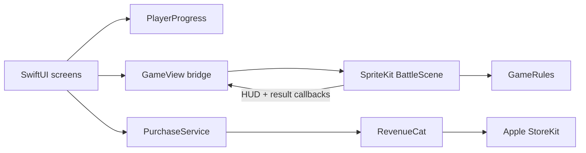

# Bastion Rush


A portrait, one-thumb squad tactics game for iPhone. Steer a growing platoon through reinforcement-versus-firepower gates, survive increasingly difficult enemy waves, and break the fortress at the end of each short run.

<p align="center">
  
  
  
</p>

## Why this version is different

- Decisions affect the current run; gates are not random visual noise.
- Runs earn persistent upgrades without requiring a purchase.
- The only in-app purchase is a cosmetic lifetime Commander Pack.
- No ads, login, analytics, location, or tracking.
- Native SwiftUI + SpriteKit keeps the project small and responsive.

## Engineering highlights

- Runs a real-time combat simulation with a frame-delta game loop, procedural wave scheduling, target selection, damage resolution, and boss-state transitions.
- Bridges imperative SpriteKit gameplay into declarative SwiftUI while keeping persistent progression outside the scene.
- Uses Swift's Observation framework for shared game and purchase state.
- Integrates RevenueCat through Swift Package Manager with entitlement-driven cosmetic unlocks and a complete restore flow.
- Includes an Apple privacy manifest, in-app legal copy, public-site source files, StoreKit test configuration, review notes, and release checklist.
- Ships with unit-tested balancing rules and debug launch arguments for repeatable visual QA.

## Architecture



`BattleScene` owns only one run. `PlayerProgress` owns durable coins and upgrades. `PurchaseService` owns store state. That boundary prevents scene recreation from duplicating rewards or losing entitlement state.

## Run it on an iPhone

1. Open `BastionRush.xcodeproj` in Xcode.
2. Connect the iPhone by cable (or enable wireless debugging) and trust the Mac.
3. Select the iPhone beside the Run button.
4. In **Signing & Capabilities**, confirm Ross's Apple Developer team is selected.
5. Press **Run** (`⌘R`).

The game itself works immediately. Real purchases need the RevenueCat setup below.

## RevenueCat setup

1. In App Store Connect, create a **non-consumable** product:
   - Product ID: `com.rosstoma.bastionrush.commanderpack`
   - Reference name: `Commander Pack`
2. Import that product into RevenueCat.
3. Attach it to entitlement `commander_pack` and to the current offering as a lifetime package.
4. Put the RevenueCat **public iOS SDK key** after `REVENUECAT_API_KEY =` in `Config/Secrets.xcconfig`.
5. Never put a Stripe or RevenueCat secret key in the app.

The included `StoreKit/BastionRush.storekit` file supports local StoreKit product simulation. The RevenueCat SDK still needs a configured public key to load its offering.

## Build and test

```sh
xcodegen generate
xcodebuild -project BastionRush.xcodeproj \
  -scheme BastionRush \
  -destination 'platform=iOS Simulator,name=iPhone 17 Pro' \
  test
```

The test suite covers upgrade-cost progression and run reward/score rules. The checked-in screenshots were captured from the built iPhone 17 Pro simulator app, not design mockups.

## Project map

- `BastionRush/Game/` — SpriteKit battle simulation and balancing rules
- `BastionRush/UI/` — onboarding, home base, armory, game HUD, paywall, legal screens
- `BastionRush/Store/` — RevenueCat purchase and restore flow
- `docs/` — App Store metadata, review notes, privacy and support webpages
- `RELEASE.md` — exact App Store submission checklist

## Monetization note

Stripe is intentionally not linked from the iOS app. Apple requires StoreKit in-app purchase for digital features. Stripe can be used later on a website only where Apple’s storefront rules and entitlements permit it.

## Résumé line

Built a native iOS squad-tactics game in SwiftUI and SpriteKit with procedural combat, persistent progression, RevenueCat/StoreKit purchases, and App Store privacy compliance.

## License

MIT — see [LICENSE](LICENSE).
